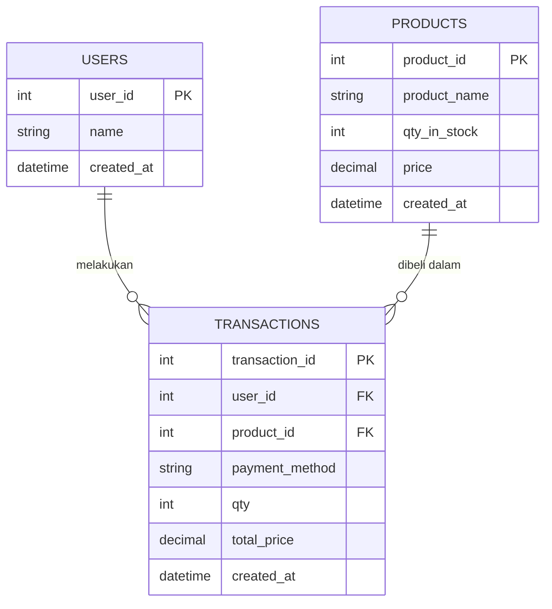

# Tugas 3: Web CMS & Simulasi Pembelian Produk (CodeIgniter 4)

Aplikasi Content Management System (CMS) berbasis PHP 8 (CodeIgniter 4) dan MySQL untuk mengelola data produk, pelanggan (users), serta mensimulasikan transaksi pembelian produk secara dinamis dengan pemotongan stok otomatis dan pembatalan transaksi dengan pengembalian stok ke gudang.

---

## Persyaratan & Lingkungan (Environment)

- Web Server: Localhost (XAMPP atau Laragon)
- PHP: Versi 8.1 atau 8.2 (ekstensi intl, mbstring, dan mysqli aktif)
- Database: MySQL / MariaDB (Port default 3306)

---

## Cara Menjalankan

Pastikan layanan MySQL di XAMPP atau Laragon sudah aktif (Running).

### Langkah 1: Setup Database

Tersedia dua opsi inisialisasi database:

#### Opsi 1: Otomatis via Migration & Seeder (Disarankan)
- Via Batch Script: Klik dua kali file setup_db.bat.
- Atau via Terminal:
  ```bash
  cd Tugas_3
  php spark migrate
  php spark db:seed DatabaseSeeder
  ```

#### Opsi 2: Import File SQL Dump
Telah disediakan dump database siap pakai: cms_simulasi_toko.sql (format UTF-8).
Dapat langsung diimpor ke MySQL melalui phpMyAdmin (http://localhost/phpmyadmin) atau terminal:
```bash
mysql -u root -p cms_simulasi_toko < cms_simulasi_toko.sql
```

---

### Langkah 2: Menjalankan Server Aplikasi

- Cara A (Otomatis): Klik dua kali file serve.bat. Script akan otomatis membuat .env dari template env jika belum ada.
- Cara B (Manual via Terminal):
  ```bash
  php spark serve --port 8080
  ```
- Buka browser dan akses aplikasi melalui tautan:
  http://localhost:8080

---

## Skema & Relasi Database



### Penjelasan Kolom:
1. users
   - user_id: Primary Key (Auto Increment).
   - name: Nama lengkap pelanggan.
   - created_at: Waktu input data pelanggan.

2. products
   - product_id: Primary Key (Auto Increment).
   - product_name: Nama barang / komoditas.
   - qty_in_stock: Jumlah sisa stok fisik di gudang.
   - price: Harga satuan produk (IDR).
   - created_at: Waktu input produk.

3. transactions
   - transaction_id: Primary Key (Auto Increment).
   - user_id: Foreign Key merujuk ke tabel users.
   - product_id: Foreign Key merujuk ke tabel products.
   - payment_method: Metode pembayaran (QRIS, Transfer Bank, GoPay, Tunai).
   - qty: Jumlah unit yang dibeli.
   - total_price: Total harga bayar (qty * price).
   - created_at: Waktu transaksi berlangsung.

---

## Fitur Utama & Alur Simulasi

1. Dashboard Overview:
   - Ringkasan kartu metrik: Total Pelanggan, Total Produk Terdaftar, Total Stok Fisik di Gudang, Total Transaksi, dan Total Omset Pendapatan.
   - Peringatan stok menipis (Low Stock Warning) jika sisa stok <= 5 unit.
   - Tabel 5 transaksi belanja terbaru.

2. CRUD Pelanggan (Users):
   - Tambah pelanggan baru dan perbarui nama.
   - Hapus pelanggan dengan proteksi relasi data (mencegah penghapusan jika pelanggan sudah memiliki riwayat transaksi aktif).

3. CRUD Produk (Products):
   - Tambah barang baru beserta harga dan stok awal.
   - Edit nama barang, harga, maupun jumlah stok.
   - Status badge otomatis berdasarkan sisa stok: Tersedia, Menipis, atau Habis.

4. Simulasi Transaksi Pembelian (Transactions):
   - Dropdown pemilihan pelanggan dan produk secara dinamis.
   - Informasi harga satuan dan ketersediaan stok muncul otomatis saat produk dipilih.
   - Total bayar terkalkulasi secara real-time saat jumlah kuantitas diubah.
   - Validasi Batas Stok: Mencegah transaksi jika kuantitas melebihi stok yang tersedia.
   - Otomasi Pemotongan Stok: Stok produk di gudang otomatis berkurang saat transaksi berhasil dibuat.
   - Pembatalan Transaksi: Menghapus riwayat transaksi otomatis mengembalikan (restock) jumlah unit barang ke tabel produk.
